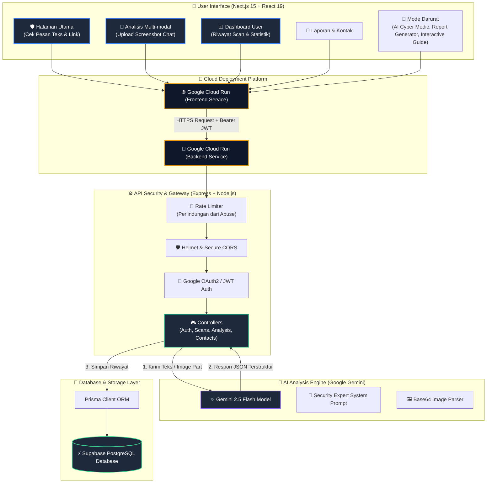

<p align="center">
  
</p>

<p align="center">
    
    
    
    
    <br>
    
    
    
    
    
</p>

<p align="center">
  <strong><i>Platform Keamanan Digital & Deteksi Penipuan Berbasis Gemini 2.5 Flash AI.</i></strong>
  <br />
  Solusi Pintar untuk Menganalisis Pesan, Link, dan Chat Screenshot Sebelum Mengklik atau Mengirim Data Pribadi.
  <br />
  Proyek Khusus untuk Kompetisi <strong>#JuaraVibeCoding2026</strong>.
</p>


## 🚀 Live Demo & Akses Cepat

Aplikasi ini telah dideploy secara penuh ke Google Cloud Run dengan performa maksimal dan latensi rendah.

> [!TIP]
> **Uji Coba Langsung di Browser Anda:**  
> 🔗 **https://amanklik-ai.vercel.app/**

---

## 🏆 Mengapa Proyek Ini Siap Memenangkan Kompetisi?

Dalam ajang **#JuaraVibeCoding2026**, sebuah aplikasi dinilai berdasarkan inovasi, kualitas arsitektur, kedalaman pemanfaatan AI, serta antarmuka pengguna yang memukau.

| Pilar Penilaian | Kriteria Utama | Solusi & Inovasi AmanKlik AI |
|---|---|---|
| 🧠 **Pemanfaatan AI** | Apakah AI diimplementasikan secara efektif dan bukan gimik? | Menggunakan **Gemini 2.5 Flash** untuk analisis multi-modal (teks pesan & gambar screenshot) serta fitur **AI Cyber Medic** untuk mendiagnosis situasi darurat pengguna pasca-insiden penipuan dengan panduan mitigasi interaktif. |
| 📊 **Kualitas Arsitektur** | Keandalan, keamanan, dan skalabilitas monorepo. | Membagi sistem menjadi **Frontend Next.js (App Router)** & **Backend Express (TypeScript ESM)**. Dilengkapi dengan secure headers (Helmet), IP Rate Limiter, autentikasi aman Google OAuth2 + stateless JWT session, serta integrasi database Supabase PostgreSQL via Prisma ORM. |
| 🎨 **UI/UX Premium** | Visual yang memukau dan pengalaman pengguna yang halus. | Menggunakan antarmuka bertema **Glassmorphism modern** dengan efek micro-interactions dinamis (Framer Motion), layout modern, dashboard statistik riwayat pemindaian yang interaktif, serta visual charting. |
| 🇮🇩 **Dampak Nyata** | Relevansi sosial untuk publik lokal. | Menyelesaikan masalah darurat penipuan digital di Indonesia (modus paket kurir APK, pinjol ilegal, impersonasi bank, kupon hadiah palsu) dengan bahasa yang ramah keluarga, serta melengkapinya dengan **Generator Surat Laporan** formal ke Bank/Polisi. |


## 🚨 Fitur Unggulan Baru: Mode Darurat (Emergency Mode)

Fitur ini dirancang khusus untuk membantu pengguna yang telah telanjur mengklik link phishing, mengunduh file APK berbahaya, atau mentransfer sejumlah uang kepada penipu. Fitur ini terdiri dari:

1. **AI Cyber Medic**: Chatbot interaktif bertenaga Gemini AI yang berfungsi melakukan diagnosis cepat mengenai tingkat keparahan insiden keamanan siber yang dialami pengguna serta memberikan pertolongan pertama yang dipersonalisasi.
2. **Generator Surat Laporan**: Alat untuk menghasilkan draf surat laporan formal secara otomatis (untuk Bank, Kepolisian, atau Kominfo/ADUANKONTEN) berdasarkan data insiden pengguna untuk mempercepat proses birokrasi penindakan hukum.
3. **Panduan Interaktif Tindakan Cepat**: Langkah-langkah taktis terperinci berdasarkan skenario ancaman siber (seperti APK Terinstal, Akun Diambil Alih, Transfer Uang, Kebocoran Data).
4. **Hub Kontak Darurat**: Daftar kontak resmi lembaga hukum dan pengaduan penipuan di Indonesia (OJK, Kominfo, Kepolisian, dll) yang dapat dihubungi secara langsung.

---

## 🧬 Arsitektur Sistem Lengkap

Visualisasi alur komunikasi data end-to-end dari interaksi pengguna di frontend hingga pemrosesan oleh Gemini AI dan penyimpanan database:




## 🧪 Core AI Logic: Analisis Multi-modal Gemini

Sistem memanfaatkan SDK `@google/genai` terbaru untuk memproses masukan multi-modal (teks & gambar) dengan prompt sistem yang mendalam untuk mendeteksi penipuan:

```typescript
// Implementasi Inti pada Backend Express (backend/src/services/gemini.service.ts)
const prompt = `
  Anda adalah analis keamanan siber profesional untuk mendeteksi penipuan digital (scam, phishing, social engineering).
  Analisis input berikut yang diterima oleh pengguna Indonesia.
  Jika ada screenshot, baca semua teks yang terlihat di gambar, perhatikan URL, nomor pengirim, nama aplikasi, nominal uang, instruksi transfer, OTP, file APK, dan indikator social engineering.
  
  Teks tambahan dari pengguna:
  "${text || "Tidak ada teks tambahan. Analisis berdasarkan screenshot yang dilampirkan."}"
  
  Berikan hasil analisis dalam format JSON murni tanpa markdown, dengan struktur berikut:
  {
    "score": number (skor risiko 0 - 100, di mana 0 sangat aman dan 100 sangat berbahaya),
    "riskLevel": "safe" | "medium" | "high" (safe jika score < 30, medium jika 30-69, high jika >= 70),
    "category": string (kategori penipuan, contoh: "Phishing Link", "Modus Kurir Paket", "Penipuan Hadiah", "SMS Spam", "Aman / Normal"),
    "summary": string (ringkasan penjelasan risiko dalam Bahasa Indonesia yang ramah keluarga/mudah dipahami orang tua),
    "redFlags": [
      {
        "indicator": string (ciri mencurigakan, contoh: "Menggunakan nomor HP tidak dikenal"),
        "explanation": string (penjelasan rinci mengapa hal ini mencurigakan),
        "severity": "high" | "medium" | "low"
      }
    ],
    "recommendations": [
      string (rekomendasi tindakan praktis, contoh: "Jangan klik link tersebut", "Hubungi call center resmi bank Anda")
    ]
  }
`;
```

---

## 📂 Struktur Direktori Proyek

Monorepo ini dikelola secara rapi dengan pembagian fungsionalitas yang terisolasi dengan baik:

```text
aman-klik/
├── frontend/              # Web Client (Next.js 15)
│   ├── src/app/           # App Router Layouts, Metadata, & Pages
│   ├── src/components/    # Komponen UI (Dashboard, Auth, Scan Section)
│   │   └── sections/
│   │       └── emergency/ # Komponen Fitur Mode Darurat (Cyber Medic, Guide, Report Generator)
│   └── src/lib/           # Client API Context & Google Auth Manager
├── backend/               # REST API Server (Express + TypeScript)
│   ├── prisma/            # Skema Database PostgreSQL (Supabase)
│   └── src/
│       ├── controllers/   # Penanganan Logika (Scan, Auth, Emergency Controller)
│       ├── database/      # Prisma Client & Sinkronisasi DB Repository
│       ├── middlewares/   # Auth Guard, CORS Secure, IP Rate Limiter, Error Handler
│       ├── routes/        # Router Endpoint (Scan, Auth, Emergency Routes)
│       └── services/      # Integrasi Gemini AI Engine
├── PANDUAN_DARURAT.md     # Panduan Tindakan Cepat Darurat Siber
└── README.md
```

---

## 📋 Endpoint API Utama

Berikut adalah daftar endpoint REST API backend yang aktif beserta status autentikasinya:

| Method | Endpoint | Autentikasi | Deskripsi / Fungsi Utama |
|:---:|---|:---:|---|
| `GET` | `/api/v1/health` | **Public** | Memeriksa status kesehatan server backend |
| `POST` | `/api/v1/auth/google` | **Public** | Registrasi/Login menggunakan Google ID Token & mengembalikan token JWT |
| `GET` | `/api/v1/auth/profile` | **Required** | Mengambil informasi detail profil user yang sedang masuk |
| `POST` | `/api/v1/analysis/scan` | **Optional** | Mengirimkan data scan (teks/gambar) ke Gemini AI dan menyimpan riwayat |
| `GET` | `/api/v1/scans` | **Required** | Mengambil seluruh riwayat pemindaian user (support filter & pagination) |
| `GET` | `/api/v1/scans/stats` | **Required** | Mengambil data statistik scan user (visual grafik dashboard) |
| `DELETE` | `/api/v1/scans/:id` | **Required** | Menghapus log riwayat pemindaian tertentu milik user |
| `POST` | `/api/v1/contact` | **Optional** | Mengirimkan pesan/pertanyaan atau laporan aduan penipuan baru |
| `POST` | `/api/v1/emergency/diagnose` | **Optional** | Menganalisis kondisi darurat siber dan mendiagnosis langkah mitigasi AI |


## ⚙️ Cara Menjalankan Aplikasi Secara Lokal

### Prasyarat Sebelum Instalasi
- [Node.js](https://nodejs.org/) versi 20 atau yang lebih baru.
- Akun [Supabase](https://supabase.com/) & Database PostgreSQL aktif.
- API Key dari [Google AI Studio](https://aistudio.google.com/).
- Google Client ID dari Google Cloud Console.

### 1. Kloning Repository
```bash
git clone <repository-url>
cd aman-klik
```

### 2. Konfigurasi & Jalankan Backend
1. Masuk ke folder backend:
   ```bash
   cd backend
   npm install
   ```
2. Salin template `.env` dan lengkapi nilainya:
   ```bash
   cp .env.example .env
   ```
   *Isi dengan `DATABASE_URL` (Supabase), `GEMINI_API_KEY`, `JWT_SECRET`, dan `GOOGLE_CLIENT_ID`.*
3. Buat prisma client dan sinkronisasikan database:
   ```bash
   npm run db:generate
   ```
4. Jalankan mode pengembangan:
   ```bash
   npm run dev
   ```
   *Backend akan berjalan di: `http://localhost:5000`*

### 3. Konfigurasi & Jalankan Frontend
1. Buka terminal baru dan masuk ke folder frontend:
   ```bash
   cd ../frontend
   npm install
   ```
2. Salin template `.env.local` dan lengkapi nilainya:
   ```bash
   cp .env.example .env.local
   ```
   *Isi dengan `NEXT_PUBLIC_GOOGLE_CLIENT_ID` dan `NEXT_PUBLIC_API_URL` (`http://localhost:5000/api/v1`).*
3. Jalankan mode pengembangan:
   ```bash
   npm run dev
   ```
   *Frontend Next.js akan berjalan di: `http://localhost:3000`*

---

## 🚀 Panduan Deployment Ke Production

### 1. Deployment Backend ke Google Cloud Run
Pastikan Docker terinstal jika ingin melakukan build kontainer secara lokal atau gunakan Google Cloud Build:
1. Deploy service backend:
   ```bash
   gcloud run deploy amanklik-backend \
     --source . \
     --platform managed \
     --region asia-southeast1 \
     --allow-unauthenticated
   ```
2. Atur environment variables pada instansi Cloud Run:
   - `PORT`: `5000`
   - `NODE_ENV`: `production`
   - `DATABASE_URL`: `postgresql://...`
   - `GEMINI_API_KEY`: `AIzaSy...`
   - `JWT_SECRET`: `rahasia_jwt_anda`
   - `GOOGLE_CLIENT_ID`: `...apps.googleusercontent.com`
   - `CORS_ORIGIN`: `https://amanklik-575126371408.asia-southeast1.run.app` (domain frontend Anda)

### 2. Deployment Frontend ke Google Cloud Run / Vercel
Jika menggunakan Google Cloud Run dengan Dockerfile:
```bash
gcloud run deploy amanklik-frontend \
  --source . \
  --platform managed \
  --region asia-southeast1 \
  --allow-unauthenticated \
  --set-build-env-vars NEXT_PUBLIC_API_URL=https://amanklik-backend-575126371408.asia-southeast1.run.app/api/v1,NEXT_PUBLIC_GOOGLE_CLIENT_ID=575126371408-24cf56dvn0m8gih1ieip7shrk3s2so17.apps.googleusercontent.com
```

### 3. Integrasi OAuth Google Console
Pastikan untuk mendaftarkan URL production frontend ke **Google Cloud Console Credentials OAuth 2.0**:
- **Authorized JavaScript Origins:** `https://amanklik-575126371408.asia-southeast1.run.app`
- **Authorized Redirect URIs:** `https://amanklik-575126371408.asia-southeast1.run.app`

---

## 🧪 Validasi Keamanan & Kompilasi
Untuk memverifikasi kualitas kode backend dan frontend sebelum diproduksi, jalankan pemeriksaan tipe TypeScript dan proses build:

```bash
# Validasi Backend
cd backend
npx tsc --noEmit
npm run build

# Validasi Frontend
cd ../frontend
npx tsc --noEmit
npm run build
```

---

## 👥 Tim Pengembang

- **Renoslendra** — Lead Creator & Developer AmanKlik AI.
- Dikembangkan secara khusus untuk menyukseskan program literasi digital Indonesia di kompetisi **#JuaraVibeCoding2026**.

---

## 📄 Lisensi

Proyek ini dilisensikan di bawah **MIT License** - lihat file [LICENSE](LICENSE) untuk detail lebih lanjut.
